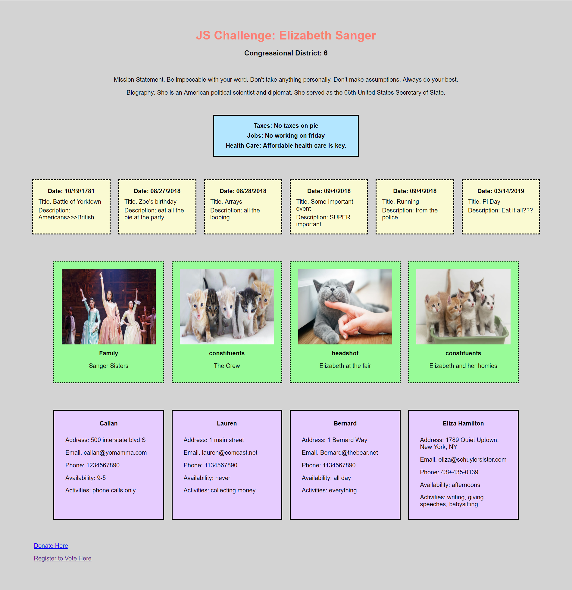

# Javascript Arrays Challenges

## Description
This purpose of this project was to display information in the DOM using a complex data structure. To view the specifics of this assingnment, click [here.](https://github.com/nss-nightclass-projects/Night-Class-Resources/blob/master/book-1-foundations/chapters/js-arrays.mdl)

## Screenshots


## How to run this project
* Use npm to install http-server in your terminal:
```sh
npm install -g http-server
```
* Run the server in your terminal
```sh
hs -p 9999
```
* Open chrome and navigate to:
```
localhost:9999
```
## Contributors
[Maggie Leavell](https://github.com/mjleavell)
